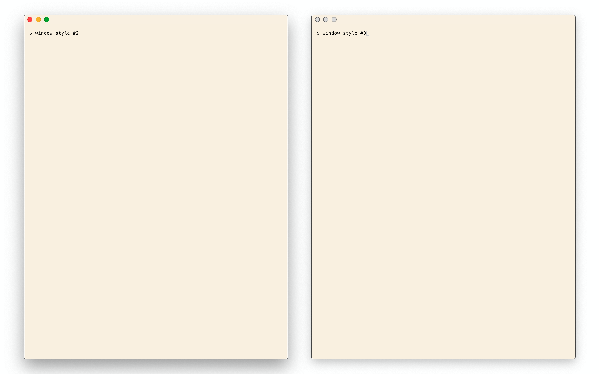
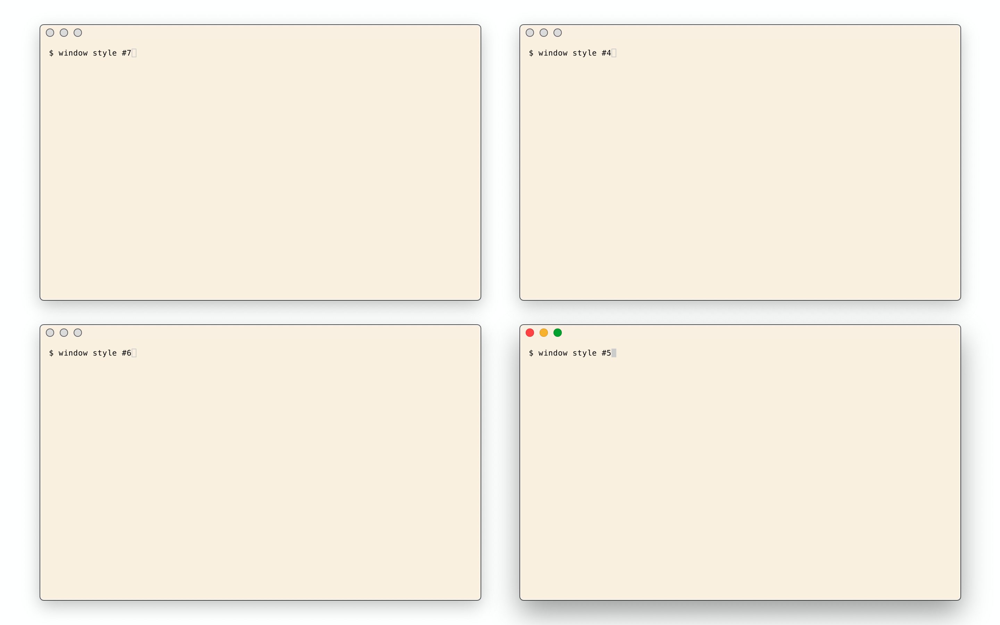

# moom-config

I have to install Moom from the App Store since I purchased it there.

# `Moom > Preferences > Mouse`

I have no idea why there's a delay by default; it's super frustrating. Set `Delay` to `None` with the slider.

# `Moom > Preferences > Keyboard`

I've bound Moom to `Command-G`, which seems to be a reasonable option for not interfering with other application keybinds.

# `Moom > Custom`

Increase `Define window sizes using` to `25` x `25`, the max size.

First, delete all existing window size presets. My presets are binary splits with 1 cell borders:

0 splits:

1 split:

2 splits:

