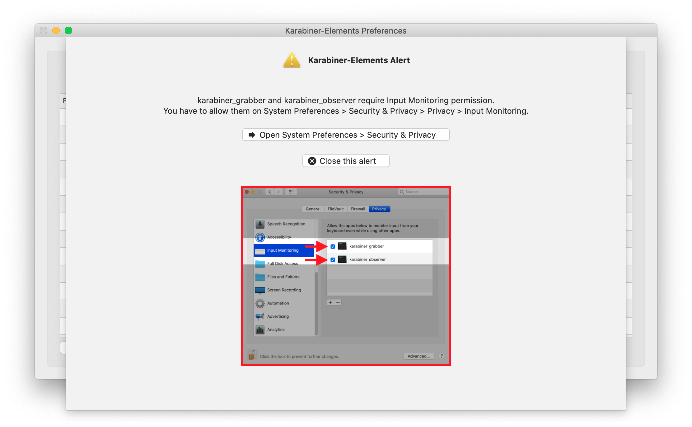

# Karabiner Configuration

## Enable Input Monitoring permission

Without enabling input monitoring, Karabiner will not work and will instead display the following message:

In order to enable input monitoring, since Karabiner doesn't properly request Input Monitoring through whatever new API macOS has requested, go to Security and Privacy and add the `karabiner_grabber` and `karabiner_observer` executibles access under Accessibility. The executibles are in the folder `/Library/Application Support/org.pqrs/Karabiner-Elements/bin`.

## Simple Modifications

I rebind `caps_lock` to `left_control` so that I actually have a use for the key and also to prevent emacs pinky.

