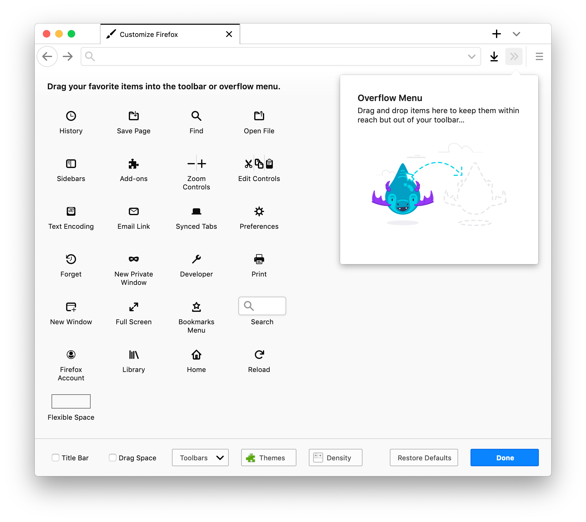

# Firefox/Tor Browser Configuration

## Theme

Go to [https://addons.mozilla.org/en-US/firefox/addon/white-image/](https://addons.mozilla.org/en-US/firefox/addon/white-image/) and click `Install Theme`.

## Preferences

### General

Enable `When you open a link in a new tab, switch to it immediately`.

### Home

I've removed everything under the Home section of preferences, setting the homepage/new tab window to `Blank Page`, and removing all of the `Firefox Home Content`.

## Navbar Configuration

Here's my navigation bar configuration:

